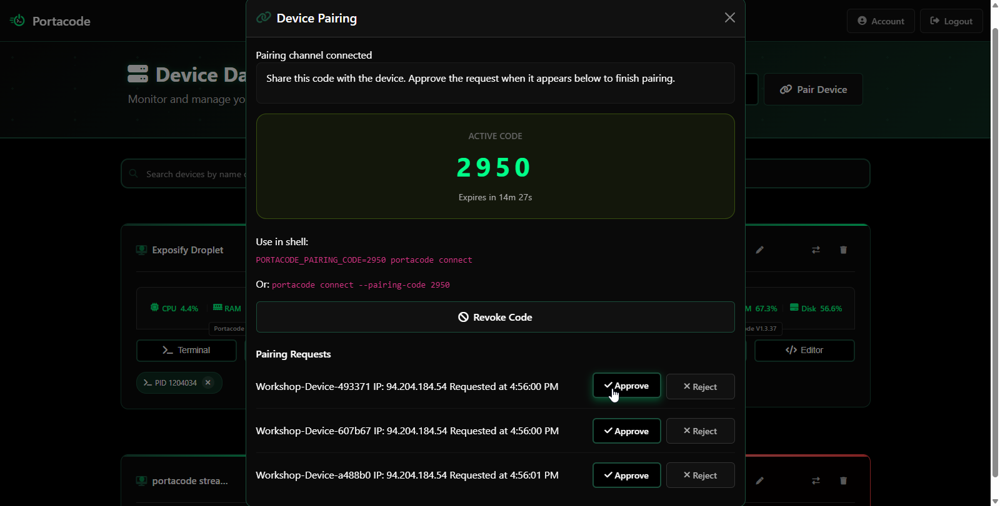
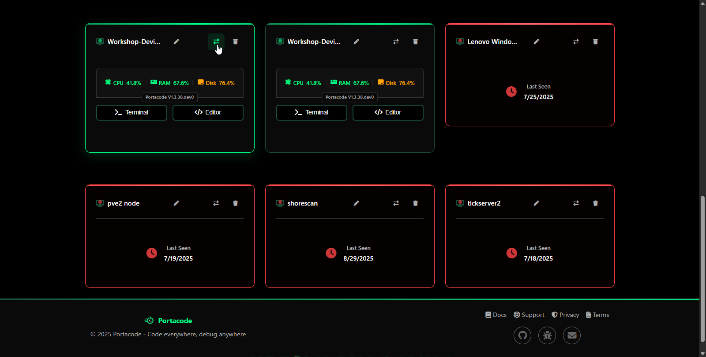

# **Quick & Easy Setup (Temporary Workspace)**

*(Fastest way to run a PortaCode workshop)*

This setup is designed for teachers who want to get a workshop running **in minutes**.
All student environments are created from a simple `docker-compose.yaml` file.
No volumes, no advanced configuration — just plug and play.

Perfect for short classes, demos, and one-off sessions.

---

## **What you need**

* A computer running **Linux** (recommended)
* **Docker** + **Docker Compose** installed
* Your Portacode dashboard open in a browser

---

## **Step 1 — Clone this repository**

```bash
git clone https://github.com/meena-erian/portacode_for_school.git
cd portacode_for_school/temporary_workspace
```

## **Step 2 — Get a pairing code**

In your Portacode dashboard:

1. Click **“Pair Device”**
2. You’ll see a **4-digit temporary code**
3. And then set the environement validable ```export PORTACODE_PAIRING_CODE=7351``` (replace 7351 with your actual pairing code)

---

## **Step 3 — Start the workshop containers**

Inside the `temporary_workspace` folder:

```bash
docker compose up -d
```

This launches the student containers.

In your Portacode dashboard, you’ll immediately see **pairing requests** — one for each container.



---

## **Step 4 — Approve the devices**

Approve each device in the dashboard.

Each container becomes a **managed Portacode device**.

---

## **Step 5 — Transfer each device to a student**

On each device card in the dashboard:

1. Click **“Transfer Ownership”**
2. Enter the student’s email address

The student now has exclusive access to their container.



---

## **How students join**

Students simply:

1. Open the link emailed to them
2. Sign in
3. Start coding in their own isolated Linux environment

Nothing to install.

---

## **Important notes**

* Student work is stored **inside the containers**
  → If a container is removed or recreated, their work can be lost.

If you need persistence and disk protection, use
**[`persistent_workspace/`](../persistent_workspace/)** instead.
